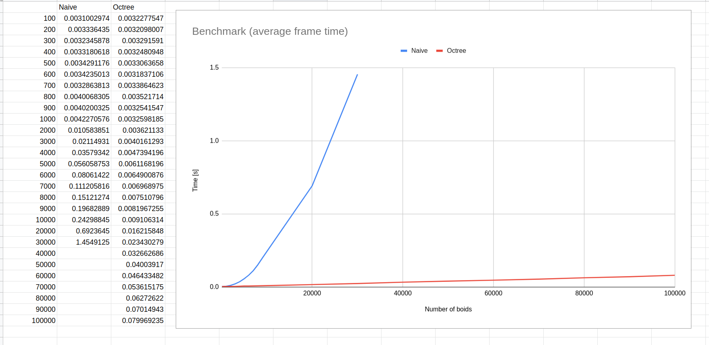

# 3D Boids simulation

## Sources

Some sources I used for inspiration and help building this.

### Boids

- http://www.red3d.com/cwr/boids/
- https://natureofcode.com/book/chapter-6-autonomous-agents/
- https://dl.acm.org/doi/10.1145/37401.37406

### Octree

- https://en.wikipedia.org/wiki/Octree
- https://magnum.graphics/showcase/octree/?spheres=20&sphere-radius=0.1&sphere-velocity=1.0
- https://castle-engine.io/vrml_engine_doc/output/xsl/html/section.how_octree_works.html

### Language and libraries used

- Rust 1.66 (programming language)
- Bevy 0.9.1 (game engine)
- Rayon 1.6.1 (multithreading)
- Nalgebra 0.31.4 (linear algebra library)

### Implementation

- The Naive and the Octree implementation include multithreading
- Menu for changing the parameters of the simulation
- Octree is implemented as an "arena allocated tree"
  - [Example 1](https://dev.to/deciduously/no-more-tears-no-more-knots-arena-allocated-trees-in-rust-44k6)
  - [Example 2 - library](https://github.com/fitzgen/generational-arena)
- The Octree is built in every call of the function "flock" - every time we update the speed of the boids

### Analysis

- Results of benchmarks

#### Possible improvements

- Updating of Octree (instead of rebuilding)
- Faster rendering speed (rendering has issues at higher number of boids)
