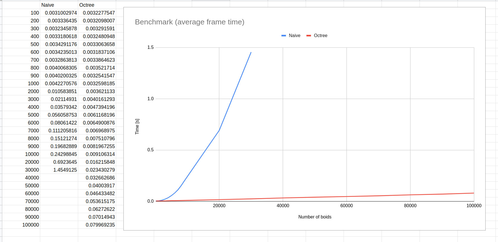

# Dodatna naloga poročilo

## 3D Boids simulation

### Viri

#### Boids

- http://www.red3d.com/cwr/boids/
- https://natureofcode.com/book/chapter-6-autonomous-agents/
- https://dl.acm.org/doi/10.1145/37401.37406

#### Octree

- https://en.wikipedia.org/wiki/Octree
- https://magnum.graphics/showcase/octree/?spheres=20&sphere-radius=0.1&sphere-velocity=1.0
- https://castle-engine.io/vrml_engine_doc/output/xsl/html/section.how_octree_works.html

#### Uporabljen jezik in knjižnice

- Rust 1.66 (programming language)
- Bevy 0.9.1 (game engine)
- Rayon 1.6.1 (multithreading)
- Nalgebra 0.31.4 (linear algebra library)

#### Implementacija

- Tako naivni kot izboljšan pristop z octree vključuje multithreading
- Implementacija vključuje meni v katerem lahko spreminjamo nastavitve simulacije
- Boidi so prikazani kot stožci
- Octree je implementiran kot "arena allocated tree" zaradi omejitev v rustu
  - [Primer 1](https://dev.to/deciduously/no-more-tears-no-more-knots-arena-allocated-trees-in-rust-44k6)
  - [Primer 2 - knjižnica](https://github.com/fitzgen/generational-arena)
- Drevo zgradimo v vsakem klicu funkcije "flock" - torej vedno, ko posodabljamo hitrosti elementov

#### Analiza

- Meritve so bile izvedene s skritimi elementi (boidi) zaradi hitrosti vizualizacije, ki pri večjem številu predstavlja ozko grlo

#### Možne izboljšave

- Namesto, da konstantno gradimo drevo na novo, ga le posodabljamo
- Izboljšati hitrost vizualizacije
